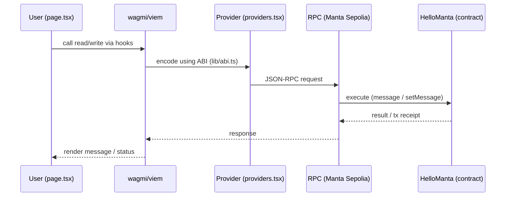
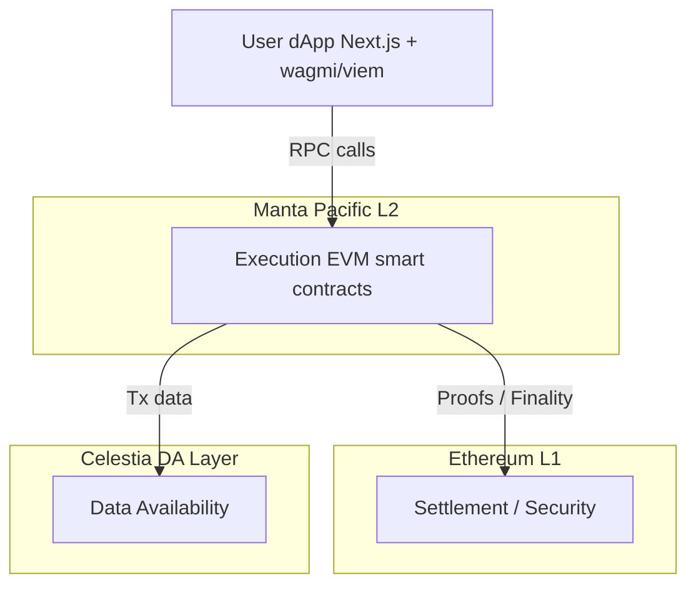

# Hello Manta

Hello Manta is a minimal smart contract + frontend project I built to explore the **Manta Pacific Testnet - Sepolia (chainId 3441006)** and get hands‑on experience creating a dApp.

The frontend is built with Next.js, **wagmi**, and **viem**. It connects to MetaMask, reads the current `message()` from the `HelloManta` contract, and lets users call `setMessage(string)` to update it. The display auto‑refreshes after each confirmed transaction and links directly to Blockscout for contract and transaction details.  

As part of this project, I also learned how to pin and serve the static build on **IPFS**, making the dApp accessible in a decentralized way.

**Live on IPFS:** [Hello Manta](https://ipfs.io/ipfs/bafybeicsotwt77usz7isilpe6fdjo6jaieicaw7tocrhhhdla5bsg3xrnu/)

**Verified Contract link on** [Blockscout](https://pacific-explorer.sepolia-testnet.manta.network/address/0x25de0C203C6215D6D27fc06E004e9485f981d87F?tab=contract_source_code)

Note: This dApp currently works only on Chrome with the MetaMask extension enabled.

## Interact on app
1.  Connect your MetaMask wallet (make sure it’s on chainId 3441006, Manta Pacific Testnet (Sepolia)).
2.  Read the current message.
3.  Update it with a new message (requires Sepolia test ETH).
4.  View contract/transaction links on Blockscout.

## What I Learned

- This was my first time building **any blockchain frontend** and connecting it to a smart contract.  
- Learned how to use **wagmi** and **viem** to manage wallet connection, contract reads/writes, and tx confirmations.  
- Understood how a **minimal ABI** (`lib/abi.ts`) enables the frontend to talk to deployed contracts.  

## Architecture Diagram

