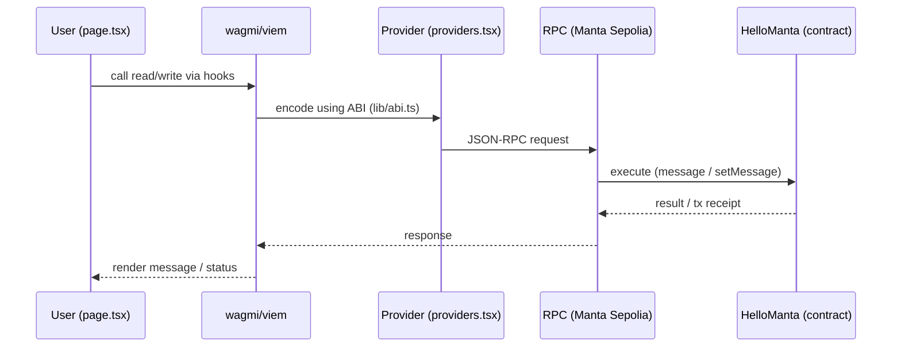

# Hello Manta

Hello Manta is a simple smart contract and minimal frontend project I built to get hands-on with the **Manta Pacific Testnet - Sepolia  (chainId 3441006)**.  

This is the minimal frontend I built with Next.js using **wagmi** and **viem**.  
It connects to MetaMask, reads the current `message()` from the `HelloManta` contract, and lets the user call `setMessage(string)` to update it.  
The app automatically refreshes the display after each confirmed transaction and links directly to the verified contract and transaction hashes on Blockscout.

**Verified Contract link on** [Blockscout](https://pacific-explorer.sepolia-testnet.manta.network/address/0x25de0C203C6215D6D27fc06E004e9485f981d87F?tab=contract_source_code)

## What I Learned

- This was my first time building **any blockchain frontend** and connecting it to a smart contract.  
- Learned how to use **wagmi** and **viem** to manage wallet connection, contract reads/writes, and tx confirmations.  
- Understood how a **minimal ABI** (`lib/abi.ts`) enables the frontend to talk to deployed contracts.  


## Setup Locally

1. **Clone the repo**  
   ```bash
   git clone <your-repo-url>
   cd hello-manta-demo
2. **Install dependencies**
    ```bash 
    npm install
3. **Configure environment**
    Create a .env.local file with:
    ```bash
    NEXT_PUBLIC_CONTRACT_ADDRESS=0x25de0C203C6215D6D27fc06E004e9485f981d87F
    NEXT_PUBLIC_RPC_URL=https://pacific-rpc.sepolia-testnet.manta.network/http
4. **Run the app**
    ```bash
    npm run dev
    ```
    then open http://localhost:3000
5. **Interact on app**
    -  Connect your MetaMask wallet (make sure it’s on chainId 3441006, Manta Pacific Testnet (Sepolia)).
    -  Read the current message.
    - Update it with a new message (requires Sepolia test ETH).
    - View contract/transaction links on Blockscout.


## Architecture Diagram


